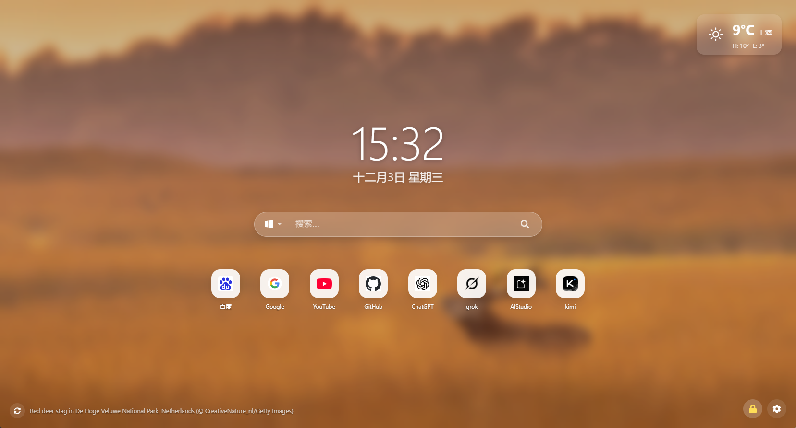
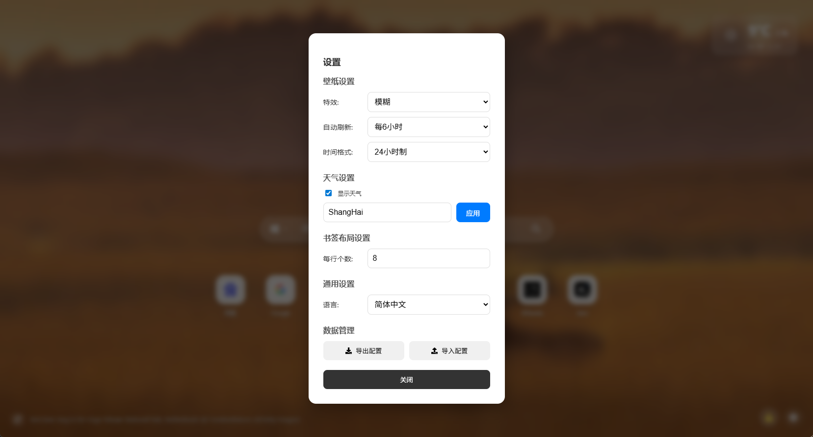

# Chrome New Tab Start Page Extension

[简体中文](./README.zh-CN.md) | English

A modern Chrome extension built with **Vite + React + TypeScript** that replaces the default new tab page with a beautiful, efficient start page experience.

## ✨ Features

### 🌅 Daily Wallpaper
- Automatically fetches Bing's daily featured images as background
- **Multiple Effects**: Support for None, Blur, and Glass display modes
- **Auto Refresh**: Configurable refresh intervals (daily, 1/6/12 hours)
- **Manual Refresh**: Random refresh button in the bottom-left corner to get Bing wallpapers from the past 8 days

### ⏰ Real-Time Clock
- Displays current time and date in the center of the page
- Automatically adapts to browser language format
- Supports 12/24-hour time format switching

### 🌤️ Weather Widget
- Shows real-time temperature, weather conditions, and daily high/low temperatures
- Supports automatic geolocation or manual city input
- Can be toggled on/off in settings

### 🔍 Multi-Engine Search
- Built-in Google, Baidu, and Bing search engines
- Supports custom search engine switching

### 🔖 Bookmark Management
- **Grid Layout**: Customize 3-10 bookmarks per row (default 6)
- **Edit Mode**: Lock/unlock functionality for drag-and-drop sorting, deletion, and editing
- **Custom Icons**: Support for icon URL input or one-click favicon retrieval
- **Accidental Click Prevention**: Clicking bookmarks in edit mode won't navigate away

### 🌐 Multilingual Support (i18n)
- **23 Languages Supported**: Including Chinese (Simplified/Traditional), English, Spanish, Arabic, French, Persian, German, Russian, Malay, Portuguese, Italian, Turkish, Kannada, Tamil, Urdu, Korean, Hindi, Bengali, Japanese, Vietnamese, Telugu, and Marathi
- **Auto-Detection**: Automatically detects browser language on first load
- **Manual Override**: Select any language from Settings
- **Persistent**: Language choice saved and included in configuration export/import

### ⚙️ Personalized Settings
- **Data Backup**: Import/export all configurations (bookmarks, wallpaper settings, layout, etc.)
- **Interface Customization**: Rich customization options to create your own start page

### 🎨 Modern Design
- Deeply optimized Glassmorphism style
- Refined rounded corners and shadow details

## 📸 Screenshots

### Main Interface


### Settings Panel


## 🚀 Development Guide

### Requirements
- Node.js (v16+ recommended)
- npm or yarn

### Install Dependencies
```bash
npm install
```

### Start Development Server
To debug the UI as a regular web page in your browser:
```bash
npm run dev
```

### Build Extension
Build production code, output to `dist` directory:
```bash
npm run build
```

## 📦 Install to Chrome

1. Run `npm run build` to generate the `dist` directory.
2. Open Chrome browser and navigate to `chrome://extensions`.
3. Enable **"Developer mode"** in the top-right corner.
4. Click the **"Load unpacked"** button in the top-left.
5. Select the `dist` folder from this project's root directory.
6. After installation, open a new tab to see the extension in action.

## 🛠️ Tech Stack

- [Vite](https://vitejs.dev/) - Next-generation frontend build tool
- [React](https://reactjs.org/) - JavaScript library for building user interfaces
- [TypeScript](https://www.typescriptlang.org/) - For better development experience and code quality
- [dnd-kit](https://dndkit.com/) - Lightweight, high-performance drag-and-drop library
- [Open-Meteo](https://open-meteo.com/) - Free weather API
- [React Icons](https://react-icons.github.io/react-icons/) - Comprehensive icon library

## 📝 Notes

- **Weather Geolocation**: On first launch, the browser will ask for location permission. Please allow to display local weather. For manual setup, enter the city name (e.g., London) in the settings panel.
- **Wallpaper Caching**: The system automatically caches wallpapers to optimize loading speed. You can also manually refresh via the button in the bottom-left corner.
- **Bookmark Icons**: Some websites may not provide favicons directly. You can manually enter the icon image URL.

---

**Enjoy your new start page!**
